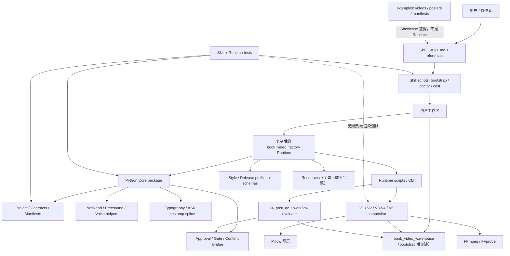

# Architecture Map

## 实际目录结构

```text
BookVideoFactory/
├── README.md / README.zh-CN.md
├── LICENSE
├── demos.html
├── docs/
│   ├── baseline/                 # Phase 0 本地报告，不属于上游生产 Runtime
│   └── audit/                    # 本轮只读审计报告
├── examples/
│   ├── manifests/                # Showcase 发布与 Gate 摘要
│   ├── posters/                  # Showcase 海报二进制资产
│   └── videos/                   # Showcase 成片二进制资产
└── skills/book-video-factory/
    ├── SKILL.md                  # 官方使用入口和工作方式
    ├── agents/                   # Skill 元数据
    ├── references/               # 首次运行、质量门、纸片拼贴说明
    ├── scripts/                  # 工作区 bootstrap、Doctor、成本薄包装
    ├── tests/                    # Skill/bootstrap 测试
    └── runtime/book_video_factory/
        ├── config/               # Style、Release、音色、音乐配置
        ├── docs/                 # Runtime 合同与 Runbook
        ├── resources/fonts/      # 只有 README 与 OFL；缺少声明的 OTF
        ├── schemas/              # Manifest、Approval、内容桥等 JSON Schema
        ├── scripts/              # CLI、Renderer、Provider 编排、QC
        ├── src/book_video_factory/ # 可复用 Python 包
        ├── tests/                # Runtime 单元/合同测试
        └── pyproject.toml
```

指令列出的以下路径实际不存在：

- 根目录 `book_video_warehouse/`：仅在 bootstrap 后的用户工作区创建。
- `.github/`。
- 根目录 `package.json`；全仓也未发现 Remotion 工程。
- 根目录 `pyproject.toml`；实际只有 Runtime 内一份。
- `requirements*.txt`。

## 主要目录职责与分类

| 目录 | 实际职责 | 分类 |
|---|---|---|
| `skills/book-video-factory/scripts/` | 将 bundled Runtime 复制到新工作区，并提供 Doctor/成本入口 | Runtime Generic |
| `runtime/.../src/book_video_factory/` | Project、Profile、Manifest、Approval、Gate、内容桥、Provider client、排版和 ASR splice | Reusable Core / Runtime Generic |
| `runtime/.../scripts/` | 具体 CLI 与生产脚本；通用能力和案例绑定代码混杂 | Runtime Generic + Legacy + Showcase Specific |
| `runtime/.../config/` | Release/Style 合同及当前机器/案例配置 | Reusable contract + Showcase Specific 混合 |
| `runtime/.../schemas/` | JSON 数据合同 | Reusable Core |
| `runtime/.../tests/` | Core、Provider policy、Renderer contract、排版测试 | Test / Fixture |
| `examples/` | 已发布展示视频、海报、清洗后的发布/Gate 记录 | Showcase Specific |
| `resources/fonts/` | 字体许可和预期路径说明；实际字体文件缺失 | Runtime resource，当前不完整 |
| `docs/baseline/`、`docs/audit/` | 本地审计证据 | Documentation Only |

## 总体模块图



## 当前核心包

`src/book_video_factory/` 是最清晰的可复用核心边界：

- `contracts.py` 与 `style_profiles.py`：Release/Style Profile 的加载、验证和映射。
- `manifests.py` 与 `gates.py`：不可变 Stage Manifest、哈希绑定审批、Release-scoped 派生状态。
- `content_bridge.py`：上游内容快照导入、校验和脚本—Claim—场景追溯。
- `project.py`：项目目录和 `project.json`。
- `typography.py`、`audio.py`、`voice.py`：局部通用媒体能力。
- `weread.py`、`freesound.py`：两个具体 HTTP Provider client，不构成统一 Provider 接口。

## 文档宣称与实现差异

| 文档或命名形成的印象 | 源码实际情况 |
|---|---|
| `build_batch_video_v3.py` 声明与 V2 分离 | 文件直接 `import build_final_video_v2 as v2`，主流程复用 V2 的时间线、Pillow 图层、FFmpeg 视觉合成、音频混合和 QC helper。执行边界未分离。 |
| VOX Style 有 `external_clip_timeline_v1` Renderer | 只有 Profile、Schema、合同校验、Gate 和文档/测试；未找到同名模块、CLI 或本地执行器。属于 Orchestration / Documentation，而非已实现 Renderer。 |
| Gemini API lane 可程序化使用 | Profile 和文档写明模型/SDK，Doctor 只检查 `google.genai`；仓库未找到 SDK client 或 `generate_videos` 调用实现。 |
| “批准稿到成片一键构建”可视作通用入口 | 实际主脚本要求固定 15 行、12 场景、特定文件名和 V2 兼容路径；只对原 V4 Profile 成立。 |
| `project.json.status` 表示工作流真状态 | `project.py` 明确标记其为 `compatibility_cache_only`；真正状态由 `gates.evaluate_workflow_state()` 派生。Renderer 仍会写该缓存字段。 |
| 配置提供跨平台字体 fallback | fallback 指向仓库未包含的 `SmileySans-Oblique.otf`，因此 Windows/无系统字体环境不能实际 fallback。 |

## Unknown

- `examples/videos/` 中除 `chaoyue-baisui-paper-collage` 外四个视频的完整生成命令和源码调用链在仓库内没有对应 Manifest，标记为 **Unknown**。
- VOX Showcase 的源项目本地母版由何种外部工具组合完成，现有清洗后的 Gate 摘要不足以还原，标记为 **Unknown**。
- 当前浅克隆只有一个提交，无法判断 Legacy 文件首次引入或被替代的历史时间，标记为 **Unknown**。

