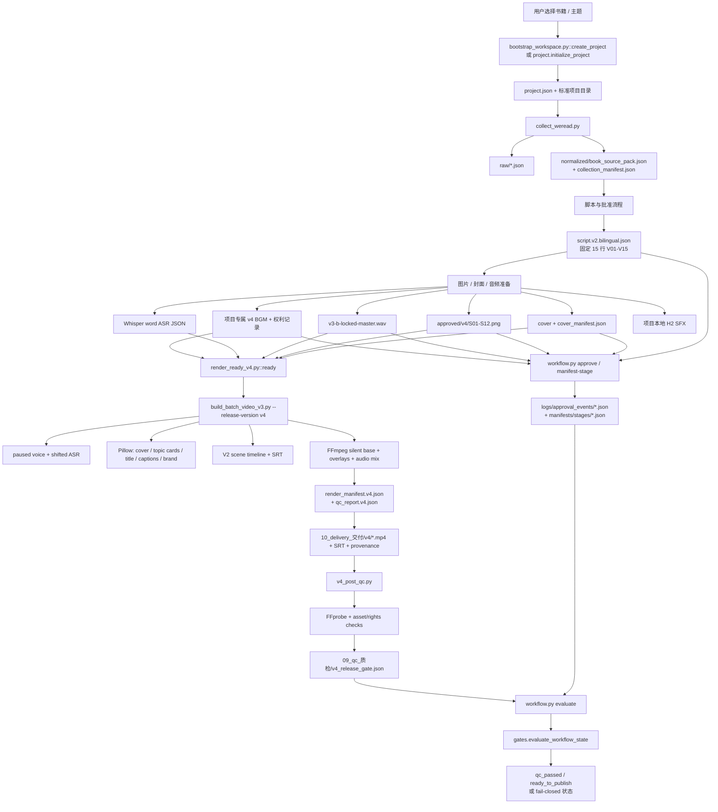

# Production Call Chain

## 结论先行

仓库中可由源码完整追踪的生产路径是原风格 V4。它不是单一 CLI 内的原子事务，而是“项目/证据准备 → 人工或外部资产步骤 → Renderer → Post-QC → 工作流 Gate”的组合。VOX 路径只有外部资产编排与导入合同，无法从仓库源码追踪到一个本地 Renderer。

另一个重要事实是：仓库没有独立的 `create_release()`。`release_id` 是调用 `workflow.py approve/manifest-stage/evaluate` 和 `v4_post_qc.py` 时由操作者传入的逻辑标识；项目初始化本身不创建 Release 记录。

## 原风格 V4 真实路径



## 分阶段源码证据

### 1. 工作区与项目

- 官方入口：`skills/book-video-factory/scripts/bootstrap_workspace.py::bootstrap_workspace()` 将 bundled Runtime 复制到用户工作区，并创建 `book_video_warehouse/projects`、`operations`、`reports`。
- 项目入口：同文件 `create_project()`，或复制后 Runtime 的 `scripts/init_project.py → book_video_factory.project.initialize_project()`。
- 输出：`project.json` 和 `00_topic_选题` 至 `10_delivery_交付`、Manifest、Approval log 等目录。
- 状态事实：`project.json.workflow.state_source` 为 `derived_gate_evaluator`，`status` 只是兼容缓存。

### 2. Research

- `scripts/collect_weread.py::main()` 调 `weread.collect_book_source_pack()`。
- Client 请求 WeRead Agent Gateway，保存原始响应与标准化 `book_source_pack.json`，并更新研究状态。
- 本轮没有调用 WeRead，也没有验证当前凭据或远端响应。

### 3. Release、Manifest 与审批

- `scripts/workflow.py approve` → `manifests.record_approval()`，审批绑定 `release_id` 与 subject SHA-256。
- `scripts/workflow.py manifest-stage` → `manifests.write_stage_manifest()`，记录输入/输出哈希和 checks。
- `scripts/workflow.py evaluate` → `gates.evaluate_workflow_state()`，按 Release 隔离审批。
- **调用链缺口**：`render_ready_v4.py` 不自动调用 `workflow.py manifest-stage` 或 `evaluate`；`--release-id` 也不是强制参数。Renderer 成功不等同发布 Gate 成功。

### 4. 文案、图片、音频与 ASR

Renderer 实际读取：

| 角色 | 固定项目相对路径或约束 | 产生方式 |
|---|---|---|
| Script | `02_story_script_故事脚本/script.v2.bilingual.json` | 人工/批次 seed/内容桥之后的批准稿；没有统一脚本生成 Provider |
| Cover | `01_research_资料搜集/sources/cover/cover_manifest.json` 指向的真实封面 | `fetch_cover.py` 或人工提供 |
| Scenes | `03_images_生成图片/approved/v4/S01..S12.png` | 仓库外生成与人工批准；仓库没有 Image Provider Adapter |
| Narration | `05_voice_人声/v3-b-locked-master.wav` | 可由 VoxCPM 脚本或外部流程生成，但文件名由 Renderer 固定 |
| ASR | `05_voice_人声/asr-v3/v3-b-locked-master.json` | `transcribe_narration.py` 调 Whisper CLI，或兼容格式的外部产物 |
| BGM | 恰好一个 `06_music_音乐/v4-*-original-bgm.mp3` | 本地 procedural generator/外部工具/人工提供，须有权利记录 |
| SFX | `06_music_音乐/H2-用户确认原片高频音效层.wav` | 用户明确 provision 的项目本地资产 |

### 5. Renderer

`render_ready_v4.py` 在资产齐备时运行：

```text
python3 book_video_factory/scripts/build_batch_video_v3.py <project> --release-version v4
python3 book_video_factory/scripts/v4_post_qc.py --project <project> [--release-id <id>]
```

`build_batch_video_v3.py::main()` 的实际顺序：

1. 加载 Release Profile、Style 与 15 行脚本。
2. `asr_with_intro_pause()` 用 FFmpeg 插入 1.040 秒停顿并移动 ASR 时间戳。
3. 验证 12 张唯一场景图；用 Pillow 合成真实封面、主题卡、标题、字幕、品牌 PNG。
4. 调 `v2.create_scene_timeline()` 与 `v2.write_subtitles()`。
5. 调 `v2.render_base_video()` 生成静音 H.264 base。
6. 调 `v2.render_variant()` 叠加 PNG，并混合旁白、BGM、SFX，输出 H.264/AAC。
7. 调 `v2.probe()` 与 `v2.loudness()` 写技术 QC。
8. 写 `render_manifest.v4.json`、`qc_report.v4.json`、交付视频/SRT/来源文件，并更新 `project.json.status` 兼容缓存。

### 6. QC 与最终状态

- `v4_post_qc.py` 用 FFprobe 检查 720×960、AAC、15 行双语、12 张唯一图、真实封面记录、单一项目 BGM、Voice/ASR。
- 它始终添加 H2 外部权利清理 Hold，并可能添加英文/封面权利 Hold。因此技术通过不自动允许公开发布。
- 最终状态必须由 `workflow.py evaluate --project ... --release-id ...` 结合不可变 Manifest 和哈希审批派生。

## VOX 路径能确认到哪里

```text
bootstrap/init（paper-collage-explainer-v1 + generation lane）
→ 外部 Gemini API 或 Google Flow（文档要求；仓库内无执行器）
→ 用户授权导出 clip manifest / silent clips
→ Gate 检查 external_clip_timeline_v1 资产合同
→ 本地音频、字幕、QC、交付（文档目标）
```

仓库内没有可执行的 `external_clip_timeline_v1` 或与该合同对应的本地合成 CLI。因此从“外部 clips”到“本地 9:16 master”的真实源码调用链是 **Unknown**，不能把 Showcase Manifest 当作实现源码。

