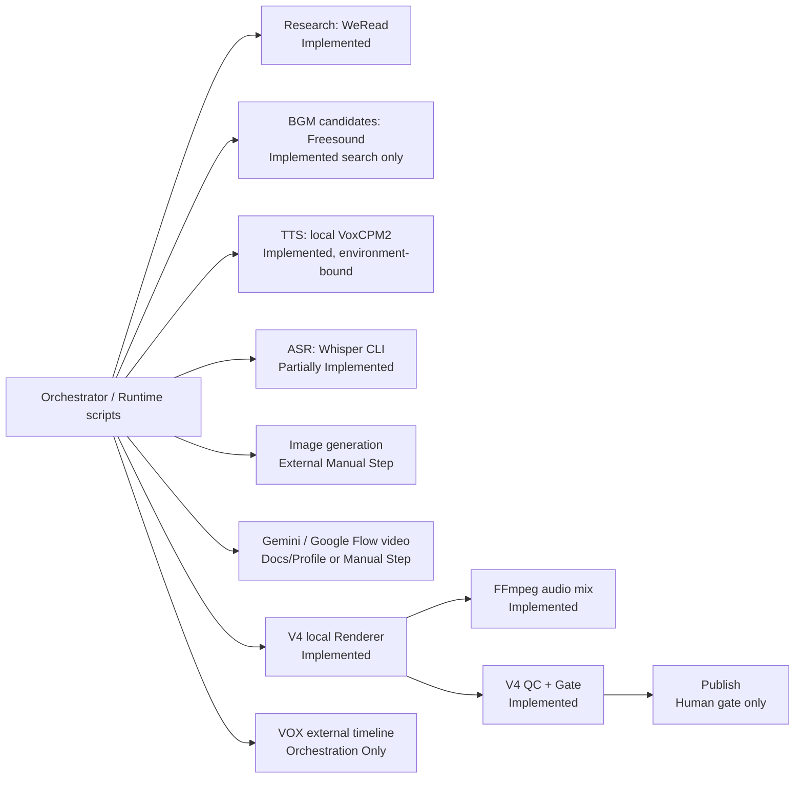

# Provider Map

## 状态图

## 能力清单

| 能力 | 当前实现 | 入口文件 | 自动化程度 | 凭据 | 本地/云端 | 生产可用性 |
|---|---|---|---|---|---|---|
| Research | WeRead HTTP Agent Gateway client、书籍匹配、raw/normalized pack | `src/.../weread.py`, `scripts/collect_weread.py` | Implemented | `WEREAD_API_KEY` 或 macOS Keychain | 云端请求 + 本地保存 | 有实现；本轮未在线验证。Windows 无 env 时 credential loader 会因 `os.uname()` 崩溃。 |
| Research alternative | 用户提供/公开可归因证据 | 文档与内容桥 | External Manual Step | 依来源而定 | 混合 | 合同允许，但无统一 Adapter。 |
| Image | Codex 内置图像生成模式、人工批准 12 张 still | `ASSET_PROVIDER_POLICY.md`, Profile/Prompt 目录 | External Manual Step | 仓库不管理内置模式凭据 | 云端/外部 | 无仓库内 Provider client、operation record writer 或下载执行器。 |
| Video / Gemini | Gemini Omni / Veo 模型与 lane 配置 | Style Profile、Skill 文档、Doctor module check | Documentation Only | `GEMINI_API_KEY` | 云端 | 未找到 `google.genai` client、Interactions 或 `generate_videos` 实际调用。不可宣称已实现。 |
| Video / Google Flow | 手工 UI 导出合同 | Style Profile、`paper-collage-explainer.md` | External Manual Step | 用户账户/计划/credits | 云端 UI | 明确不是 API；仓库只负责导入与证据要求。 |
| TTS | VoxCPM2 voice design / ultimate clone | `generate_narration.py`, `generate_voice_auditions.py`, `voice.py` | Implemented | 本地模型与授权 reference | 本地 | 代码可运行，但默认模型路径、专用 Python runtime、`device: mps` 和示例音色绑定使当前 Windows 默认不可直接生产。 |
| ASR | 调 OpenAI Whisper CLI 输出 word timestamps | `transcribe_narration.py` | Partially Implemented | 无云 API key；需安装 CLI/模型 | 本地 | 输入/输出合同明确；Phase 0 显示 Whisper 未配置，本轮未执行。 |
| Alignment | 中文行与 ASR word 对齐；音频 splice 后 timestamp 调整 | V2/V3 Renderer、`src/.../audio.py` | Implemented | 无 | 本地 | 可用但实现重复；V4 未复用已测试的 `audio.splice_asr_timestamps()`。 |
| BGM generation | 程序化生成 original BGM | `generate_original_bgm.py` | Implemented | 无 | 本地 | 可生成本地音频；不代表自动完成审美与权利 Gate。 |
| BGM candidate search | Freesound 搜索、许可过滤、候选 Manifest，不下载 | `freesound.py`, `freesound_music.py` | Implemented candidate-only | `FREESOUND_API_KEY` / Keychain，商业授权环境标记 | 云端请求 + 本地记录 | 默认 `noncommercial_preview_only`，不是可发布 BGM Provider；Windows credential loader 同样有 `os.uname()` 问题。 |
| BGM / ChatCut | 用户账户生成并放入项目目录 | `compose_v5_from_chatcut_bgm.py` | External Manual Step + local compositor | 用户 ChatCut/Mureka 账户 | 云端生成 + 本地合成 | 只对 V5 repair recipe 有实现，不是通用 Provider。 |
| Audio Mix | FFmpeg trim/fade/loudnorm/duck/delay/amix | `build_final_video_v2.py::render_variant()` | Implemented | 无 | 本地 | 当前 V4 生产使用；与视觉 overlay 同一 filter graph，尚未解耦。 |
| Renderer / V4 | Pillow + FFmpeg 确定性 3:4 渲染 | `build_batch_video_v3.py` + V2 helper | Implemented | 无 | 本地 | 当前主 Renderer；固定 V4 输入合同。 |
| Renderer / VOX | `external_clip_timeline_v1` 合同 | Profile、Schema、Gate | Orchestration Only | 外部生成渠道决定 | 混合 | 没有仓库内 Renderer/CLI；生产调用链 **Unknown**。 |
| QC | Renderer smoke QC、V4 Post-QC、Release-scoped derived Gate | V3/V4 scripts、`v4_post_qc.py`, `gates.py` | Implemented | 无 | 本地 | Core Gate 有测试；Post-QC 和真实媒体链无测试。 |
| Publish | 哈希绑定 `publish` approval | `workflow.py`, `gates.py` | Human gate only | reviewer identity/evidence | 本地决策记录 | 没有平台上传、排期或发布 API。 |

## Provider 解耦判定

结论：**Provider 层没有统一解耦，只在部分合同和文档层完成了分类。**

证据：

- 没有共同的 `Provider`/`Adapter` interface、registry、统一 Request/Result 或 capability discovery。
- WeRead 与 Freesound 是两个直接实现的具体 client；调用脚本直接 import 具体类。
- VoxCPM 脚本直接 import 模型包、读取具体配置并写产物。
- Image 没有代码 Adapter；Gemini/Flow 只有 Style 配置和人工流程。
- Alignment 与 Audio Mix 嵌在 Renderer 脚本，不是可替换 Provider。
- Profile 能选择 generation lane，但“能选择配置”不等于“对应执行器已实现”。

## 凭据与安全边界

- WeRead/Freesound 首选环境变量并不打印 secret，这是合理边界。
- macOS Keychain fallback 使用 `security`；Windows 平台判断错误会使缺少 env 的路径直接崩溃。
- Gemini key 只在文档/Doctor 中被要求从环境读取；因无执行器，本轮无法验证 secret 是否会被正确隔离。
- Publish 只有本地审批事件，不含对外写操作。

## Unknown

- 当前 WeRead Gateway 与 Freesound API 凭据是否有效：本轮禁止外部 API，故为 **Unknown**。
- VOX Showcase 使用的具体 Gemini/Flow/其他生成器及调用参数：清洗后的 Manifest 不足以确认，故为 **Unknown**。
- 外部 Provider 当前价格、配额、区域资格和 API 生命周期：本轮未联网核验，故为 **Unknown**；配置中的模型名只能视为仓库声明。

