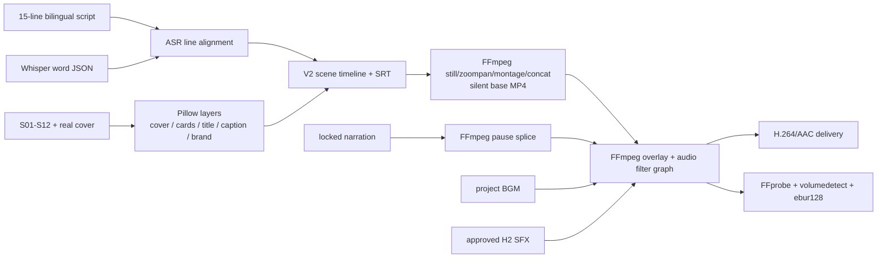

# Rendering Pipeline Map

## Renderer 数量与主入口

仓库有 4 个会输出或重组最终视频的可执行入口，但角色不同：

1. `build_final_video.py`：V1 单书 Showcase Renderer。
2. `build_final_video_v2.py`：V2 多版本 Renderer，同时充当 V3/V4 的函数库。
3. `build_batch_video_v3.py`：V3/V4 Renderer；`--release-version v4` 是当前原风格生产入口。
4. `compose_v5_from_chatcut_bgm.py`：从已有 V4 silent base/Manifest 重组 V5.x，不是独立视觉 Renderer。

若只统计“从原始场景资产构建视觉时间线的独立 Renderer”，数量为 3；若统计所有成片合成入口，数量为 4。Profile 额外声明的 `external_clip_timeline_v1` 没有实现，不计为可执行 Renderer。

当前生产编排是：

```text
render_ready_v4.py
  → build_batch_video_v3.py --release-version v4
     → import build_final_video_v2 as v2
  → v4_post_qc.py
```

## V4 画面、字幕与音频



### Pillow 调用位置

| 文件/函数 | 产物 | 通用程度 |
|---|---|---|
| `build_batch_video_v3.py::compose_real_cover()` | 真实封面合成 PNG | V4-specific path，算法可抽取 |
| `make_topic_cards()` | 8 张开场主题卡 | V4 template-specific |
| `build_title_layer()` | 标题/作者 PNG + layout JSON | 较通用，受 Release Profile 安全区约束 |
| `make_overlays()` | title、brand、15 行 caption PNG | V4-specific；brand/caption 复用 V2 |
| `build_final_video_v2.py::render_caption_layer()` | 中英字幕透明 PNG | Runtime Generic + template assumptions |
| `render_brand_layer()` | 品牌图层 | Style-specific |
| V1 overlay functions | 标题、标签、字幕、Outro | Showcase Specific |

字幕不是 FFmpeg `drawtext`：脚本先用 Pillow 生成每行透明 PNG，再由 FFmpeg `overlay=0:0:enable='between(t,...)'` 按 ASR 对齐时间叠加。SRT 同时由 `write_subtitles()` 作为独立交付物输出。

## FFmpeg / FFprobe 调用链

| 调用文件/函数 | 输入 | 输出 | 主要 filter/操作 | 可被 Renderer Adapter 包装 | 示例资产绑定 |
|---|---|---|---|---|---|
| `build_batch_video_v3.py::asr_with_intro_pause()` | 固定锁定旁白 WAV | paused PCM WAV | `atrim`, `afade`, `concat`, `anullsrc` | 是，作为音频预处理 step | 高：固定 1.040 秒与文件名 |
| `build_final_video_v2.py::render_still_clip()` | 单张场景图 | H.264 clip | `scale/crop`, `zoompan`, fps, yuv420p | 是，视觉 Adapter 内 | 低到中；算法通用、尺寸/动效固定 |
| `render_montage()` | 8 张 topic card | 静音 montage MP4 | 多输入 `scale`, `zoompan`, `concat` | 是 | 中：8 卡与 V4 montage |
| `render_base_video()` | scene timeline + clips | `base-v2-3x4.mp4` | concat demuxer / stream copy | **是，最佳中间边界** | 中：legacy 输出名与 BOOK asset path |
| `prepare_intro_voice()` | V2 voice | paused voice | `atrim`, silence, `concat` | 是 | 高：V2 splice constants |
| `render_variant()` | silent base、PNG overlays、voice、BGM、SFX | final MP4 | video `scale/crop/pad/overlay`; audio `atrim`, `loudnorm`, `afade`, `sidechaincompress`, `adelay`, `amix`; libx264/AAC | 是，但须先拆视觉/音频耦合 | 中高：参数来自 style + 固定模板逻辑 |
| `probe()` | final MP4 | JSON metadata | FFprobe streams/format | 是，QC Adapter | 否 |
| `volume_segment()` | final MP4 | 片段音量指标 | `volumedetect` | 是，QC Adapter | 否 |
| `loudness()` | final MP4 | LUFS/peak | `ebur128=peak=true` | 是，QC Adapter | 否 |
| `v4_post_qc.py::probe()` | delivery MP4 | stream JSON + Gate JSON | FFprobe | 是，Release QC | V4 检查字面量绑定 720×960/15/12 |
| `build_final_video.py` V1 | V1 assets/voice/BGM/PNG | V1 preview/final | zoompan、concat、overlay、ducking、ebur128 | 不宜直接包装 | 高：《兜底》专属 |
| `generate_original_bgm.py` | 临时 WAV | MP3 | 音频编码 | 可作 BGM step | 低 |
| `build_sfx_auditions.py` | voice/BGM/H1/H2 | audition 音频 | 多输入 mix | 否，Showcase recipe | 高 |

## 编码与混音

`render_variant()` 是当前最关键也最难替换的边界。它在同一 `filter_complex` 中：

- 规范画布并逐个叠加透明 PNG；
- 对旁白做 loudness/延迟；
- 对 BGM 做 trim、loudnorm、fade 和 montage boost；
- 用旁白 sidechain duck BGM；
- 延迟 SFX，并与 BGM、旁白 `amix`；
- 最终再 loudnorm、截断时长并编码 H.264/AAC。

因此现状没有独立的“纯视觉 Renderer API”和“纯音频 Finalizer API”。Remotion 若接管全部视觉，需要先拆这个函数；若仅替换 silent base，现有函数可直接作为兼容 Finalizer。

## 固定资产依赖

- V1/V2 直接绑定《兜底》与具体封面/BGM。
- V4 不绑定具体书名，但绑定 15 行脚本、12 张 `Sxx.png`、8 张 Topic Card、固定 voice/ASR 文件名、H2 文件名和 3:4 画布。
- V5 绑定已有 V4 base/overlays/Manifest 和 ChatCut BGM 目录。
- VOX 的 9:16 clips 只在合同/Gate 中出现，没有可审计的本地合成实现。

## 可统一包装的步骤

优先可包装：

1. `Timeline + assets → silent visual base`。
2. `silent base + overlays + audio inputs → encoded master`（先兼容包装 V2）。
3. `master + Release Profile → QC Result`。
4. `RenderResult artifacts → immutable Stage Manifest`。

不应直接包装成“通用 Renderer”的内容：V1 main、V2 的《兜底》main、seed batch、SFX audition 和 V5 ChatCut repair recipe。

